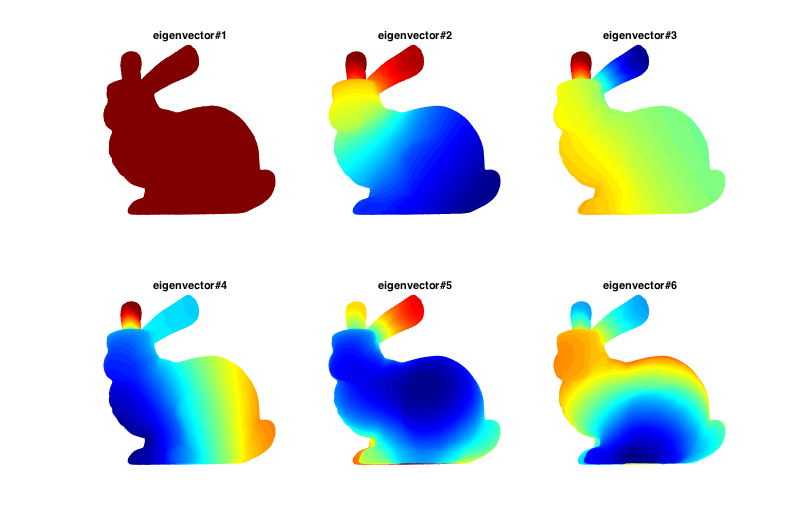

# Cotangent Weighted Laplace 
Laplace operator is one of the most popular tools in geometry processing. It is the building block of many algorithms and it is applicable for most of the geometric applications, including shape retrieval, shape correspondence, and so on.

Here is a nice paper introducing the Laplace operator:   
Reuter, Martin, Franz-Erich Wolter, and Niklas Peinecke. "Laplace–Beltrami spectra as ‘Shape-DNA’of surfaces and solids." Computer-Aided Design 38.4 (2006): 342-366.

Here is another nice tutorial for learning Laplace operator:  
http://ddg.cs.columbia.edu/SGP2014/LaplaceBeltrami.pdf

