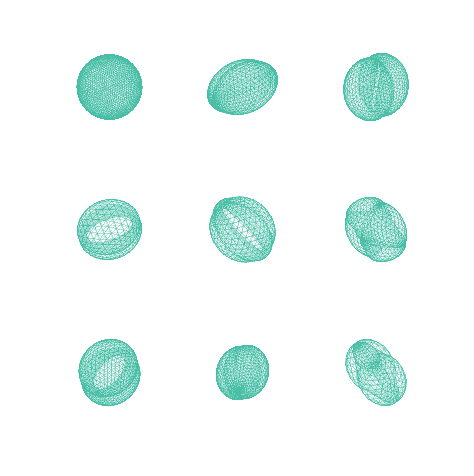

# Dirac Sphere
The cited paper introduces the discretization of Dirac operator. When applying the operator to a sphere, the eigenfunctions correspond to relativistic wave functions of an electron orbiting an atomic nucleus. This code applies Dirac operator to a sphere and visualize its eigenfunctions, also called Dirac sphere.

Reference:  
Crane, Keenan, Ulrich Pinkall, and Peter Schröder. "Spin transformations of discrete surfaces." ACM Transactions on Graphics (TOG). Vol. 30. No. 4. ACM, 2011.

