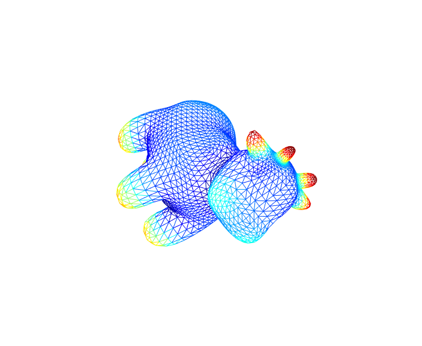

# Heat Kernel Signature
Heat Kernel Signature is an shape signature based on heat diffusion. It is wildely used in many geometric application, such as shape retrieval.

Reference:  
1. Sun, Jian, Maks Ovsjanikov, and Leonidas Guibas. "A Concise and Provably Informative Multi‐Scale Signature Based on Heat Diffusion." Computer graphics forum. Vol. 28. No. 5. Blackwell Publishing Ltd, 2009.

