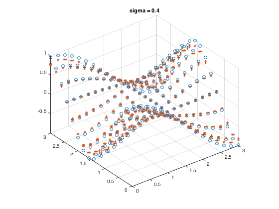

# Moving Least Squares (MLS) Approximation
MLS is a method of reconstructing implicit functions from a set of point samples. In Computer Graphics, it is widely used for 3D reconstruction from point cloud.

Reference:  
Kolluri, Ravikrishna. "Provably good moving least squares." ACM Transactions on Algorithms (TALG) 4.2 (2008): 18.

