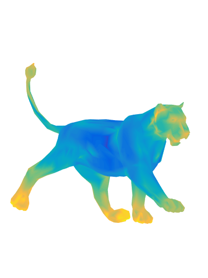

# Mesh Saliency vis Spectral Processing
Mesh saliency is a measure of the importance of a local region on a 3D surface mesh. This code is a demo of computing mesh saliency via spectral processing, which corresponds to the section 2 of the cited paper.

Reference:  
Song, Ran, et al. "Mesh saliency via spectral processing." ACM Transactions on Graphics (TOG) 33.1 (2014): 6.

